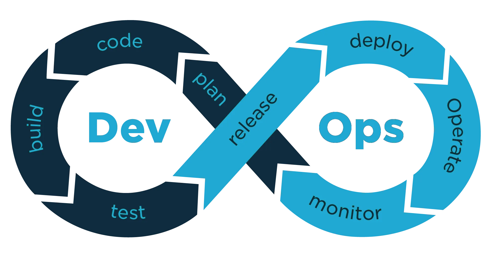

# Dashboard Estimador Codex - tech.DevOps



A web-based dashboard application built with Flask to estimate the potential cost of OpenAI API calls for various models (like GPT-3.5 Turbo, GPT-4o Mini, GPT-4o, etc.) based on user-provided prompts and code files.

This tool helps developers anticipate API usage costs before running actual Codex tasks by analyzing the token count of the input context (prompt + code).

<!-- Add a screenshot here later if you like -->
<!--  -->

## Features

*   **Web Interface:** User-friendly dashboard built with HTML, CSS, and JavaScript.
*   **Prompt Input:** Text area for users to describe the task for the AI model.
*   **File Upload:**
    *   Supports uploading multiple individual code files (`.py`, `.js`, `.html`, `.css`, etc.).
    *   Supports uploading a single `.zip` archive containing a project folder structure.
*   **Token Calculation:** Uses the `tiktoken` library to accurately count input tokens based on the combined prompt and file contents.
*   **Cost Estimation:** Calculates estimated costs for different OpenAI models based on their respective input/output pricing tiers (uses a fixed estimate for output tokens).
*   **Results Display:** Presents the estimated input/output tokens and costs in a clear table format.
*   **CSV Export:** Allows users to download a detailed report in CSV format, including the prompt, list of processed files, and the estimation results.
*   **Custom Branding:** Features custom header and footer with tech.DevOps branding and contact links.

## Technologies Used

*   **Backend:** Python 3, Flask
*   **Frontend:** HTML, CSS, JavaScript
*   **Token Counting:** `tiktoken` (OpenAI's tokenizer library)
*   **Dependencies:** Werkzeug (Flask dependency)

## Prerequisites

Before you begin, ensure you have the following installed:

*   [Python 3](https://www.python.org/downloads/) (version 3.8 or higher recommended)
*   [pip](https://pip.pypa.io/en/stable/installation/) (Python package installer, usually comes with Python)
*   [Git](https://git-scm.com/downloads/) (Optional, if you clone the repository)

## Setup and Installation

Follow these steps to set up the project locally:

1.  **Clone or Download:**
    *   If you have Git:
        ```bash
        git clone <your-repository-url> codex-estimator-dashboard
        cd codex-estimator-dashboard
        ```
    *   Alternatively, download the project files (e.g., from the `.zip` archive you have) and navigate into the main project directory (`codex_estimator_dashboard/`) in your terminal.

2.  **Create a Virtual Environment (Recommended):**
    *   This keeps project dependencies isolated.
    ```bash
    python -m venv venv
    ```

3.  **Activate the Virtual Environment:**
    *   **Windows (Command Prompt/PowerShell):**
        ```cmd
        .\venv\Scripts\activate
        ```
    *   **macOS / Linux (Bash/Zsh):**
        ```bash
        source venv/bin/activate
        ```
    *   **for deactivate:**
        ```
        deactivate
        ```
    *   You should see `(venv)` preceding your terminal prompt.

4.  **Install Dependencies:**
    *   Install the required Python packages using the `requirements.txt` file:
    ```bash
    pip install -r requirements.txt
    ```
    *   (If you don't have `requirements.txt`, you can install manually: `pip install Flask tiktoken Werkzeug`)

## Running the Application

1.  **Ensure your virtual environment is activated.** (See step 3 above).
2.  **Run the Flask development server:**
    ```bash
    python estimador_codex_v4.py
    ```
    *   This command executes the main Python script for the application.
    *   The output will indicate that the server is running, usually on `http://127.0.0.1:5000/`.

3.  **Access the Dashboard:**
    *   Open your web browser and navigate to `http://127.0.0.1:5000`.

4.  **Stopping the Server:**
    *   Press `Ctrl+C` in the terminal where the server is running.

**Note:** The application currently runs in `debug=True` mode, which is helpful for development (provides detailed error messages and auto-reloads on code changes) but should be turned off for production deployment. It also runs on `host='0.0.0.0'` making it accessible on your local network; change this to `'127.0.0.1'` if you only want it accessible from your own machine.

## Project Structure

codex_estimator_dashboard/
├── estimador_codex_v4.py # Main Flask application file (backend logic)
├── templates/
│ └── index.html # HTML template for the web interface
├── static/
│ ├── css/
│ │ └── style.css # CSS styles for the dashboard
│ ├── js/
│ │ └── script.js # JavaScript for frontend interactions (API calls, UI updates)
│ └── images/
│ └── devop.webp # Header logo image
├── venv/ # Python virtual environment directory (if created)
├── requirements.txt # List of Python dependencies
└── README.md # This file

## Author

*   **Assis Berlanda de Medeiros**
    *   LinkedIn: [linkedin.com/in/assismedeiros](https://www.linkedin.com/in/assismedeiros/)
    *   GitHub: [github.com/assisberlanda](https://github.com/assisberlanda)
    *   Portfolio: [techdevops.replit.app](https://techdevops.replit.app/)# codex_estimator_dashboard
